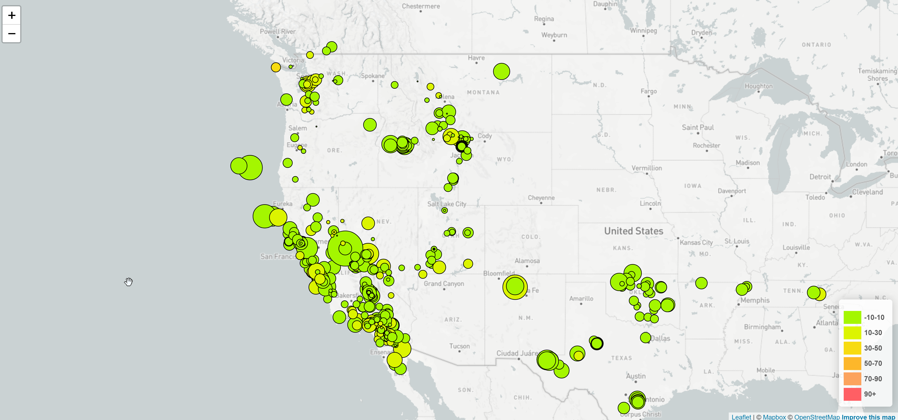
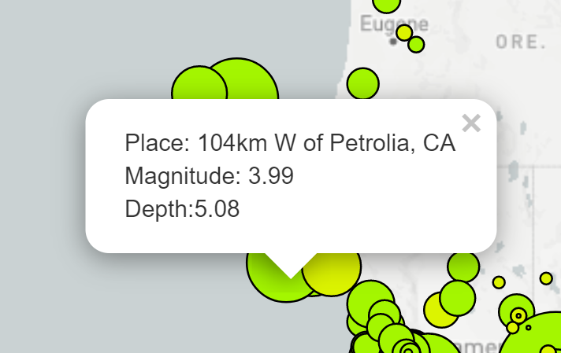

# leaflet-challenge

This repository uses the [leaflet.js](https://leafletjs.com/reference-1.7.1.html) javascript library and the [mapbox api](https://docs.mapbox.com/api/overview/) to create an interactive map that renders circle markers based off of earthquake data. The dataset used for this is the dataset for all earthquakes within the past 7 days from the [United States Geological Service](https://earthquake.usgs.gov/earthquakes/feed/v1.0/geojson.php). The dataset is in a JSON format.

[d3.js](https://d3js.org/) is used to read in the dataset, from which a map is created with the following characteristics:
* Initial zoom centered around Salt Lake City, UT
* Circle markers on the map indicate the location of the earthquake
* Size of the marker indicates the magnitude of the earthquake
* Color of the marker indicates the depth of the earthquake event in km (green color - lower depth, red color - higher depth)

The final product ends up looking like the following:

Tooltips were also added to display the location of the event, and exact magnitude/depth values. An example tooltip is shown below:

**NOTE:** To render the map properly, a mapbox api key must be obtained (free). This key is stored in a file called *config.js* in a variable called *API_KEY*. This file has not been pushed to the repository for privacy reasons (listed in .gitignore file). 
